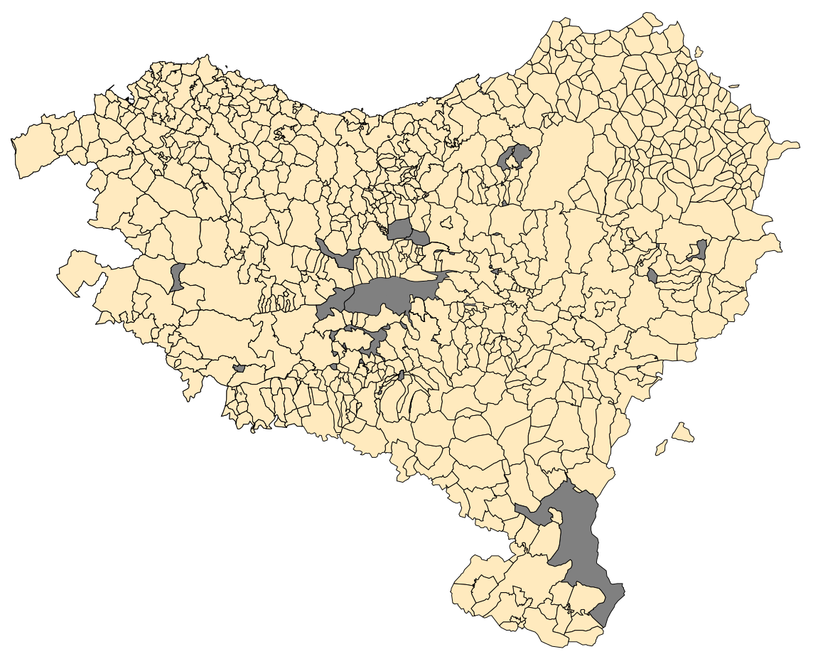

# 🗺️ Interactive Map of Euskal Herria

  
*Interactive vector map with dynamic municipality highlighting and search functionality*

## 🌍 Project Description

An advanced interactive SVG map of the Basque Country featuring:

- 🎨 **Dynamic coloring** of municipalities by province
- 🔍 **Smart search** with Wikipedia API integration
- 🖱️ **Click & hover interactions** for detailed information
- ✅ **Checkbox controls** for province visualization
- 📱 **Fully responsive** design for all devices

## ✨ Key Features

### 🗃️ SVG Map Engine
- Each municipality is a `<path>` element with unique ID matching official codes
- Real-time coloring based on province selection
- Optimized vector graphics with smooth rendering

### 🔍 Intelligent Search System
- Autocomplete suggestions as you type
- Wikipedia API integration for rich content
- Instant municipality highlighting
